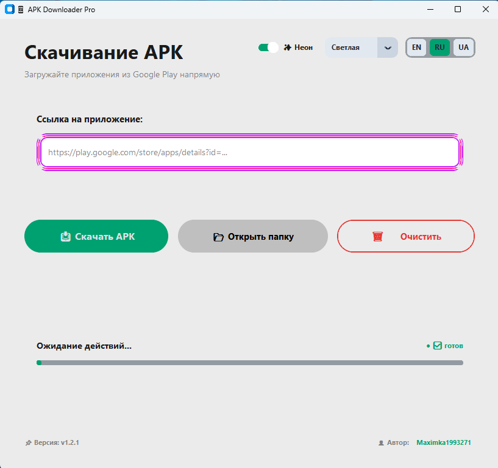
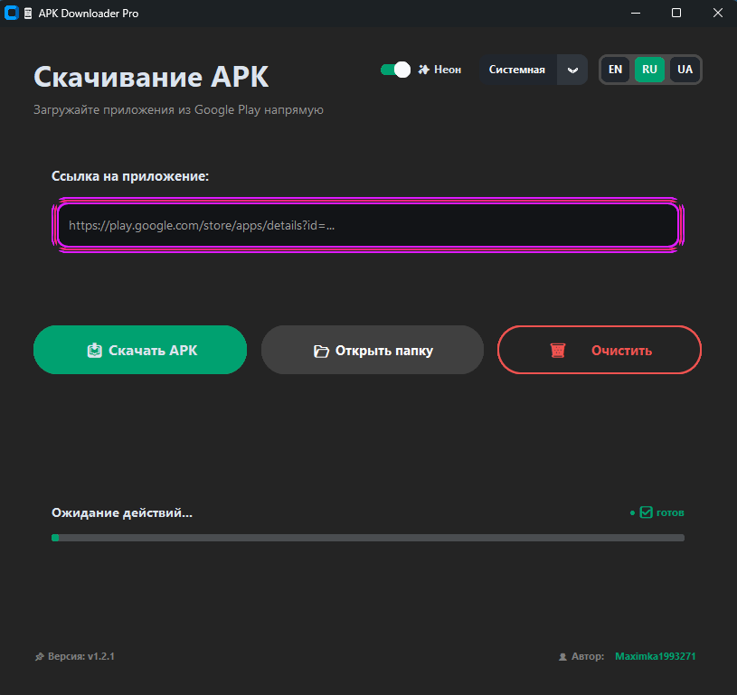

<h1 align="center">📱 APK Downloader Pro</h1>

<p align="center">
  <a href="https://github.com/Maximka1993271/APK-Downloader-Pro/releases">
    
  </a>
  <a href="https://www.python.org/">
    
  </a>
  <a href="LICENSE">
    
  </a>
  <a href="https://github.com/Maximka1993271/APK-Downloader-Pro/releases">
    
  </a>
  <a href="https://github.com/Maximka1993271/APK-Downloader-Pro">
    
  </a>
  <a href="https://github.com/Maximka1993271/APK-Downloader-Pro">
    
  </a>
  <a href="https://github.com/Maximka1993271/APK-Downloader-Pro">
    
  </a>
</p>

<p align="center">
  <b>🚀 Удобный desktop-клиент для загрузки APK-файлов напрямую из Google Play</b><br/>
  Просто, быстро и безопасно. Поддержка русского, украинского и английского языков.<br/>
  <b>🔓 Free • Open Source • Privacy First • Cross-Platform</b>
</p>

---

<div align="center">
  <table>
    <tr>
      <td align="center">
        
        <br/>
        <b>☀️ Light Theme</b>
      </td>
      <td align="center">
        
        <br/>
        <b>🌙 Dark Theme</b>
      </td>
    </tr>
  </table>
</div>

---

## ⚠️ Official Source Warning

> **🚨 IMPORTANT: This is the ONLY official distribution channel for APK Downloader Pro.**
>
> This application is **only published on GitHub** under this repository:
> **[https://github.com/Maximka1993271/APK-Downloader-Pro](https://github.com/Maximka1993271/APK-Downloader-Pro)**
>
> **I DO NOT upload this application to:**
> - ❌ Any app stores
> - ❌ Telegram
> - ❌ File hosting services
> - ❌ Social media platforms
>
> **If you find this application anywhere else, it is NOT the original version and may contain malware, spyware, or modified code.**
>
> **Always download from the official GitHub repository only!**

---

## ⚠️ Важное предупреждение / Important Warning

> **🚨 ВНИМАНИЕ! / WARNING!**

**🇷🇺 На русском:**
> Данный проект использует **неофициальный доступ к Google Play**. Google может пометить, заблокировать или ограничить аккаунты, используемые с этим инструментом. Пожалуйста, используйте отдельный аккаунт и продолжайте использование на свой страх и риск.

**🇬🇧 In English:**
> This project uses **unofficial Google Play access**. Google may flag, lock, or restrict accounts used with it. Please use a separate account and continue at your own risk.

**⚠️ Рекомендации / Recommendations:**
- Создайте **отдельный Google аккаунт** для использования с gplaydl / Create a **separate Google account** for use with gplaydl
- Не используйте основной аккаунт / Do not use your main account
- Автор не несет ответственности за блокировки / Author is not responsible for any bans

---

## ⭐ Project Highlights

- ✅ **Free & Open Source** — MIT License
- ✅ **Cross-Platform** — Windows, Linux, macOS
- ✅ **Direct APK Download** — From Google Play via gplaydl
- ✅ **3 Languages** — Русский, Українська, English
- ✅ **3 Themes** — Light, Dark, System (auto-sync with OS)
- ✅ **Neon Animation** — Modern glowing interface
- ✅ **APK Signature Verification** — Via apksigner (optional)
- ✅ **Settings Persistence** — Saved in user's AppData
- ✅ **Async Download** — Non-blocking interface
- ✅ **No Ads • No Tracking • No Telemetry**
- ✅ **100% Local Processing**

---

## 📱 Полная инструкция для начинающих

### Что нужно сделать перед запуском программы:

**Для пользователей .exe файла (не нужен Python!):**

1. **На компьютере**: Скачайте `APK_Downloader_Pro.exe` из [Releases](https://github.com/Maximka1993271/APK-Downloader-Pro/releases)
2. **На компьютере**: Запустите файл (никаких установок не требуется!)
3. **На телефоне**: Нужно получить токен для gplaydl (см. инструкцию ниже)

---

## 📱 Подготовка телефона для получения токена

### Шаг 1: Откройте сайт на телефоне

На **телефоне** откройте браузер и перейдите по ссылке:
👉 **[https://dispenser.gplaydl.com/](https://dispenser.gplaydl.com/)**

### Шаг 2: Войдите в Google аккаунт

1. Нажмите **"Sign in with Google"**
2. Выберите аккаунт, с которого хотите скачивать APK
3. Подтвердите вход

> ⚠️ **Рекомендация:** Используйте **отдельный Google аккаунт**, не основной!

### Шаг 3: Скопируйте токен

1. После входа вы увидите **персональный токен** (длинный набор символов)
2. **Скопируйте токен** (нажмите на него или скопируйте вручную)

> ⚠️ **Важно!** Токен дает доступ к скачиванию APK. Не передавайте его никому!

### Шаг 4: Отправьте токен на компьютер

Отправьте скопированный токен на компьютер любым способом:
- 📧 **Email** — отправьте себе на почту
- 💬 **Telegram** — отправьте в сохраненные сообщения
- 📝 **Запишите** — просто перепишите в блокнот на компьютере

---

## 💻 Настройка на компьютере

### Для пользователей .exe файла (без Python):

1. **Скачайте и запустите** `APK_Downloader_Pro.exe`
2. В программе нажмите **"📥 Скачать APK"**
3. Когда программа попросит токен — **вставьте скопированный токен**
4. Выберите куда сохранить APK файл
5. Готово! ✅

### Для пользователей Python (из исходников):

```bash
# Установите gplaydl
pip install gplaydl

# Привяжите аккаунт (вставьте токен)
gplaydl link

# Запустите программу
python apk_downloader.py

🚀 Quick Start
Option 1: Download Ready .exe (Windows) — БЕЗ PYTHON!
Go to Releases

Download APK_Downloader_Pro.exe

Run and enjoy! 🎉

Option 2: Run from Source Code (нужен Python)
bash
# Clone the repository
git clone https://github.com/Maximka1993271/APK-Downloader-Pro.git
cd APK-Downloader-Pro

# Install dependencies
pip install -r requirements.txt

# Run the application
python apk_downloader.py
📋 Requirements
Для .exe файла:
❌ НЕ нужен Python!

❌ НЕ нужны установки!

✅ Только Windows 7/8/10/11

✅ Интернет соединение

Для исходников:
Python 3.8 or higher

gplaydl for APK downloading:

bash
pip install gplaydl
🔑 Настройка gplaydl (только для Python версии)
bash
gplaydl link
Во время выполнения команды:

Введите ваш токен с dispenser.gplaydl.com

Нажмите Enter

После успешной привязки, программа сможет скачивать APK! ✅

🎯 How to Use
1. Вставьте ссылку на приложение из Google Play
text
https://play.google.com/store/apps/details?id=com.example.app
Или просто укажите Package ID: com.example.app

2. Нажмите "📥 Скачать APK"
3. Выберите место сохранения файла
4. Дождитесь завершения загрузки ✅
✨ Features
Feature	Description
📥 APK Download	Direct download from Google Play
🌍 3 Languages	Русский, Українська, English
🎨 3 Themes	Light, Dark, System (auto-sync with OS)
✨ Neon Animation	Modern glowing interface with color cycling
🔒 Signature Check	APK verification via apksigner (optional)
💾 Settings Save	Saved to user's AppData folder
⚡ Async Download	Non-blocking interface
📂 Save Dialog	Choose where to save APK file
⌨️ Context Menu	Copy/Paste/Cut/Clear for URL field
🔗 Package ID Input	Support for direct package ID input
🖥️ Cross-Platform	Windows, Linux, macOS
📊 Progress Bar	Real-time download progress
🐛 v1.2.1 Features
✅ Full localization: Russian, Ukrainian, English

✅ Three themes: Light, Dark, System

✅ Neon animation with color cycling

✅ APK signature verification (via apksigner)

✅ Settings saved to user's AppData folder

✅ Proper error handling and user feedback

✅ Asynchronous download without UI freezing

✅ Context menu for URL field (copy/paste/cut/clear)

✅ Progress bar with real-time updates

✅ GitHub profile link in footer

🔒 Privacy
All processing is performed locally on your machine.
No advertisements, tracking, telemetry, analytics or user data collection.
Your privacy is 100% protected.

📸 Screenshots
<div align="center"> <table> <tr> <td align="center">  <br/> <b>☀️ Light Theme</b> </td> <td align="center">  <br/> <b>🌙 Dark Theme</b> </td> </tr> </table> </div>
⌨️ Keyboard Shortcuts
Shortcut	Action
Enter	Start download (in URL field)
Ctrl+V	Paste from clipboard
Context Menu	Copy/Paste/Cut/Clear
🛠️ Build EXE
bash
# Install PyInstaller
pip install pyinstaller

# Create EXE
pyinstaller --onefile --windowed --name=APK_Downloader_Pro apk_downloader.py
